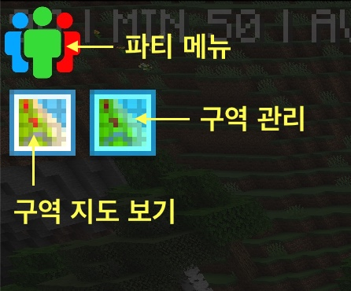
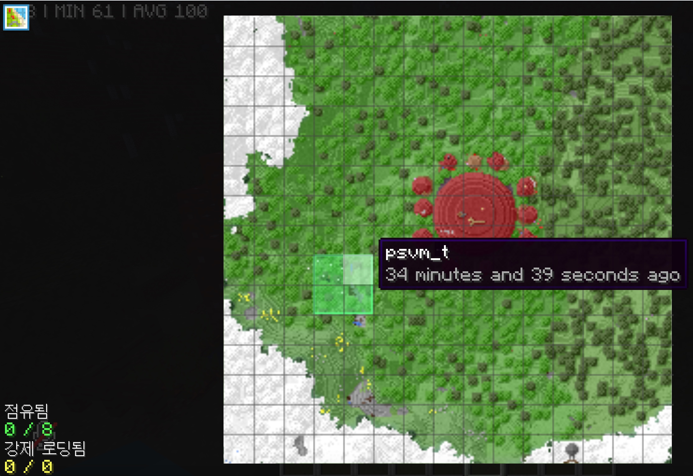
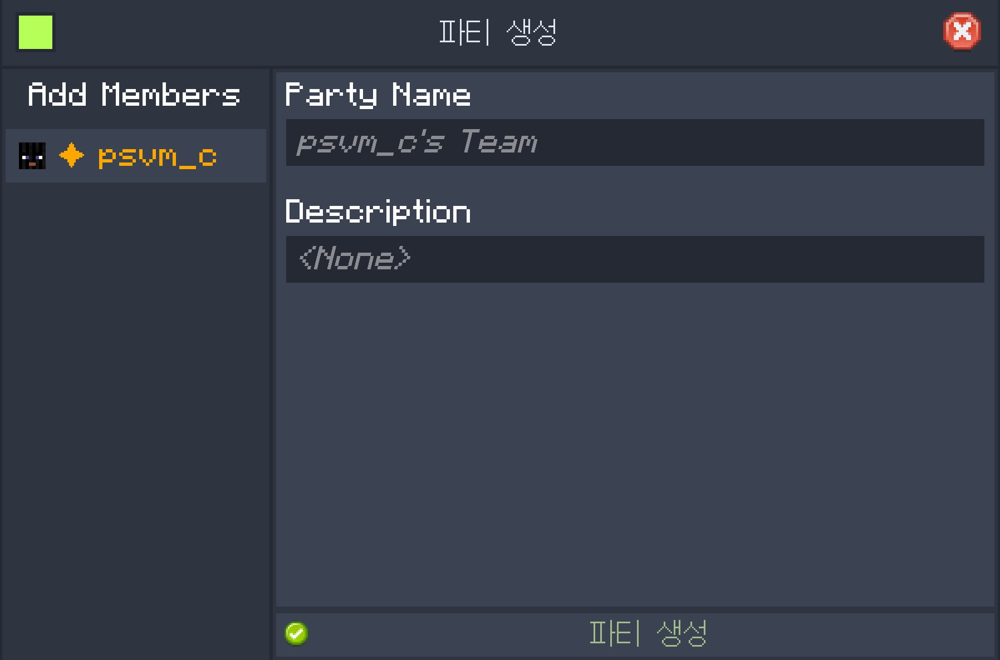

## 청크

청크는 마인크래프트에서 구역을 나누는 단위입니다. 가로와 세로가 각각 16 블록, 높이는 384블록입니다.

청크를 보고 싶다면 `F3 + G`를 눌러보세요.

## 지역 보호

청크 단위로 내 구역을 지정하면 다른 사람이 내 구역을 함부로 훼손할 수 없습니다.

- 블록 설치/부수기 방지
- 블록 상호작용 방지 (버튼 클릭, 상자 열기 등)
- 엔티티 상호작용 방지 (보트 타기 등)

구역 지정은 **최대 8청크까지 지정** 가능합니다.

다른 사람들이 지정한 구역을 보려면 인벤토리 창의 **좌측 상단에 `FTB Chunks` 버튼**을 눌러 확인하세요.

## 내 구역 지정하는 방법

1. 인벤토리 창을 열어서 좌측 상단에 `FTB Chunks: Claim Manager` 버튼을 누르세요.

2. 원하는 청크를 마우스 좌클릭으로 선택합니다. (클릭시 즉시 반영)
3. 마우스 우클릭을 눌러 구역을 해제할 수도 있습니다.

## 파티 만들기

파티를 만들어 구역을 다른 사람과 공유할 수 있습니다. 같은 파티원끼리는 구역내에서 블록 설치/부수거, 상호작용을 할 수 있습니다.

1. 좌측 상단 `내 팀` 버튼을 누르세요.
2. `파티 만들기`를 누르고 이름과 설명을 적고 파티 생성을 누르세요.
3. 다시 파티 메뉴로 들어가 우측 상단에 `Invite Player` 버튼을 눌러 초대할 수 있습니다.
